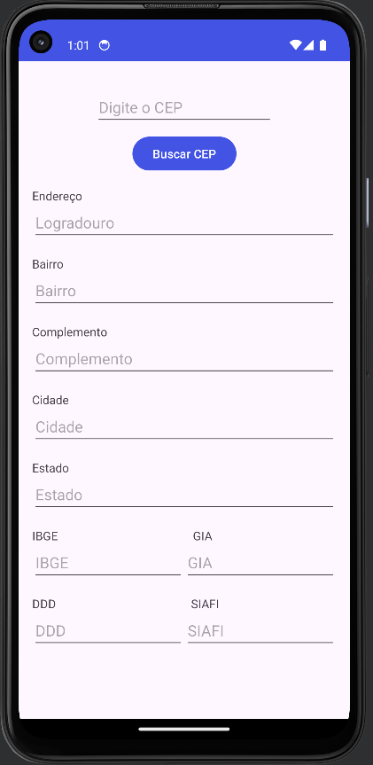
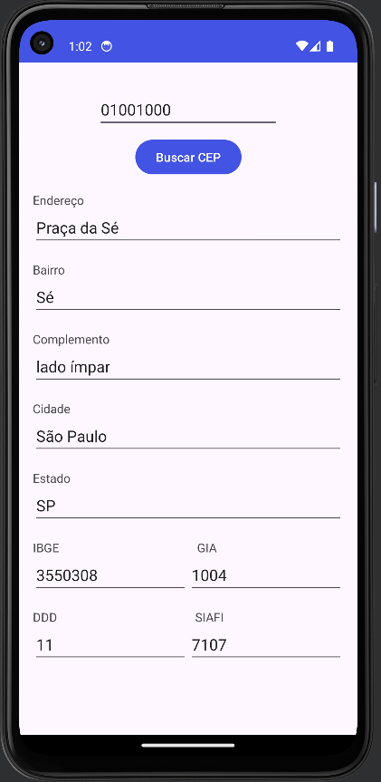

# APP ViaCEP API

O aplicativo mostra como é feito um consumo de uma API utilizando o webservice gratuito da ViaCEP.

<div style="display: flex;" align="center">
  
  
</div>


## Linguagem de Programação

Foi utilizado a linguagem de programação Kotlin de maneira nativa

- Kotlin version "1.9.0"
- SDK 34
- Java 17
- Android Gradle Plugin 8.1.2
- Gradle Version 8.0

## Dependências

Bibliotecas:
- Retrofit 2.9.0 
- Gson Converter 2.9.0 
- Android Material 1.12.0

## Instalação

Instruções de instalação do projeto.

1. Clone o repositório: 

	`git clone https://github.com/johabfreitas/apiviacep.git`

2. Importe o projeto para o Android Studio:

	`File > New > Import Project...`

3. Configure as dependências no arquivo `build.gradle.kts (Module:app)` :
	```dependencies {
        implementation ("com.squareup.retrofit2:retrofit:2.9.0")
        implementation ("com.squareup.retrofit2:converter-gson:2.9.0")
    	}```

4. Habilite no arquivo `build.gradle.kts (Module:app)` o view binding :
	```android {
		buildFeatures {
    		viewBinding = true
    	}
	} ```


## Uso

Instruções sobre como utilizar o projeto:
	Crie um emulador no Android Studio e execute o APP

## Contribuição

Se quiser contribuir com o projeto, siga estas etapas:

1. Faça um fork do projeto
2. Crie uma branch para sua feature (`git checkout -b feature/MinhaFeature`)
3. Faça commit das suas alterações (`git commit -am 'Adicione uma nova feature'`)
4. Faça push para a branch (`git push origin feature/MinhaFeature`)
5. Crie um novo Pull Request

## Licença

Este projeto está licenciado sob a [Licença MIT](https://opensource.org/licenses/MIT) - veja o arquivo [LICENSE](LICENSE) para mais detalhes.

