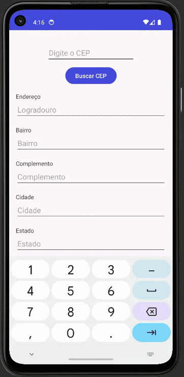

# APP ViaCEP API

O aplicativo mostra uma API sendo consumida pelo Webservice gratuito da ViaCEP.

<div style="display: flex;" align="center">
  
  
  
</div>


## Linguagem de Programação

Foi utilizado a linguagem de programação Kotlin de maneira nativa

- Kotlin version "1.9.0"
- SDK 34
- Java 17
- Android Gradle Plugin 8.1.2
- Gradle Version 8.0

## Dependências

Bibliotecas:
- Retrofit 2.9.0 
- Gson Converter 2.9.0 
- Android Material 1.12.0

## Instalação

Instruções de instalação do projeto.

1. Clone o repositório: 

	`git clone https://github.com/johabfreitas/apiviacep.git`

2. Importe o projeto para o Android Studio:

	`File > New > Import Project...`

3. Configure as dependências no arquivo `build.gradle.kts (Module:app)` :


		```dependencies {
	         implementation ("com.squareup.retrofit2:retrofit:2.9.0")
	         implementation("com.squareup.retrofit2:convertergson:2.9.0")
		   }```

4. Habilite no arquivo `build.gradle.kts (Module:app)` o view binding :


		``` android {
	                buildFeatures {
	                    viewBinding = true
					}
			  }```


## Uso

Instruções sobre como utilizar o projeto:
	Crie um emulador no Android Studio e execute o APP

## Contribuição

Este repositório foi criado para fins de estudo, com base nas aulas de mentoria do curso [Profissão Desenvolvedor Android](https://codans.com.br) do professor [Jamilton Damasceno](https://www.linkedin.com/in/jamiltondamasceno).

Se quiser contribuir com o projeto, siga estas etapas:

1. Faça um fork do projeto
2. Crie uma branch para sua feature (`git checkout -b feature/MinhaFeature`)
3. Faça commit das suas alterações (`git commit -am 'Adicione uma nova feature'`)
4. Faça push para a branch (`git push origin feature/MinhaFeature`)
5. Crie um novo Pull Request

## Autor

Feito por Johab Freitas
[](https://www.linkedin.com/in/johabfreitas/)

## Licença

Este projeto está licenciado sob a [Apache License, Version 2.0](https://www.apache.org/licenses/LICENSE-2.0) - veja o arquivo [LICENSE](LICENSE) para mais detalhes.
